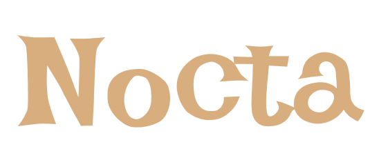

  

<!-- 
  
 -->

<h3 align="center"><strong>Nocta</strong></h3>

  

    Sleep Tracker and Monitor
    <!--  
    <a href="https://deviniter.site/docs/introduction"><strong>Explore the docs »</strong></a>
     
     
    <a href="https://github.com/Pet3r1512/DevIniter/issues/new?template=bug_report.md">Report Bug</a>
    ·
    <a href="https://github.com/Pet3r1512/DevIniter/issues/new?template=feature_request.md">Request Feature</a> -->
  

# Welcome to Nocta - Sleep Tracker and Monitor

Our mission is to empower you to optimize your sleep, enhance your overall quality of life, and identify potential health risks at the earliest stage.

As a developer or engineer, you spend a significant portion of your day coding, building, and fixing bugs. Therefore, you might underestimate the importance of sleep. Nocta is here to help you optimize your sleep and improve your overall well-being.

## How does Nocta work?

Every night, your sleep is divided into multiple cycles, each containing different stages. Waking up at the right stage can help reduce stress and improve your overall well-being.

You choose the time you want to go to sleep, and Nocta will calculate and provide several optimal wake-up times, ensuring you get the best possible rest.

## What are Nocta's future plans?

Currently, we are building a free and non-authenticated version where you can calculate wake-up times whenever you need.

In the future, there will be a version where you must sign in to save your sleeping times and get simple analytics from your sleep data.

Additionally, there will be a premium version, where Nocta offers features that can predict potential health risks and provide a better sleep plan based on your previous sleep quality, duration, age, or occupation.

Stay tuned for the latest updates and enhancements!

## Developers section

### Tech stacks

<strong>Front End</strong>:

- Tanstack Start
- Tailwind CSS
- ShadCN
- Pretiier

<strong>Back End</strong>:

- Hono
- TypeScript
- tRPC
- AWS
